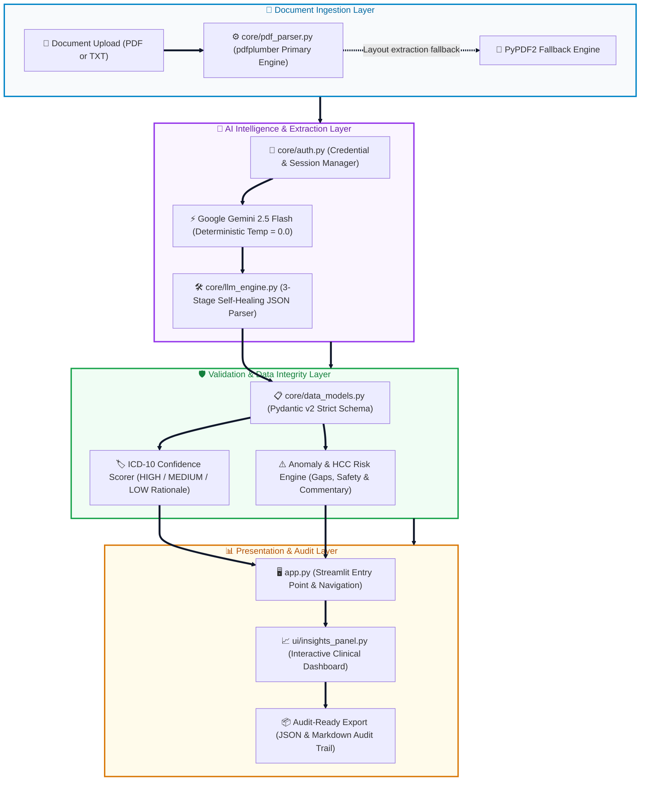

# ClinicalIQ — Clinical Natural Language Intelligence Platform
> Cotiviti Intern Assessment Submission

<div align="center">

[](https://python.org)
[](https://streamlit.io)
[](https://ai.google.dev)
[](LICENSE)

**A production-grade AI platform that transforms unstructured clinical documents into structured, ICD-10-coded, audit-ready intelligence.**

[▶ Watch on YouTube](https://youtu.be/EeJGUwHj6do) · [📥 Download MP4 (v1.0.0)](https://github.com/nanda-81/Cotiviti_Assessment/releases/tag/v1.0.0) · [Quick Start](#quick-start) · [Features](#features) · [Architecture](#architecture) · [Deliverables](#deliverables)

</div>

---

## Demo Video

<div align="center">

### ▶ [Watch on YouTube (Instant Stream)](https://youtu.be/EeJGUwHj6do) &nbsp;|&nbsp; 📥 [Download Full Video MP4 (v1.0.0 Release)](https://github.com/nanda-81/Cotiviti_Assessment/releases/tag/v1.0.0)

[](https://youtu.be/EeJGUwHj6do)
[](https://github.com/nanda-81/Cotiviti_Assessment/releases/tag/v1.0.0)

> **What the video covers:** Topic concept & definition · Technology evolution (past/present/future) · Cotiviti strategic alignment & challenges · Live application demonstration (`app.py`) · Recommendations & conclusion

</div>

---

## What This Is

Healthcare has a documentation problem. When a physician sees a patient, they write a detailed clinical note — rich with diagnoses, severity indicators, and treatment decisions. But when the insurance claim is submitted, all of that gets compressed into a handful of billing codes selected by a human coder, often reviewing 100+ charts per day.

**ClinicalIQ** is a working proof-of-concept that demonstrates how Large Language Models can serve as the first-pass reading layer in an automated chart review pipeline — extracting every diagnosis with its ICD-10 code, all medications, and flagging coding gaps and clinical anomalies, at a scale no human team could match.

This is built as a strategic response to one of Cotiviti's core operational challenges: **automating retrospective chart review for payment integrity and HCC risk adjustment**.

---

## Quick Start

### 1. Clone and install
```bash
git clone https://github.com/nanda-81/Cotiviti_Assessment.git
cd Cotiviti_Assessment
pip install -r requirements.txt
```

### 2. Configure your API key
```bash
cp .env.example .env
# Edit .env and add your Gemini API key from https://aistudio.google.com
```

### 3. Run the application
```bash
streamlit run app.py
```

Open **http://localhost:8501** — upload any clinical PDF or TXT file and extract structured intelligence in ~30 seconds.

---

## Features

| Feature | Description |
|---|---|
| **ICD-10 Extraction** | Every diagnosis coded to highest specificity with confidence rating (HIGH / MEDIUM / LOW) |
| **Supporting Evidence** | Verbatim quote from the source document for each extracted finding |
| **Medication Reconciliation** | Full drug list with dose, route, frequency, indication, and safety flags |
| **Anomaly Detection** | Coding gaps, HCC capture opportunities, preventive care flags, drug safety alerts |
| **HCC Risk Commentary** | CMS Hierarchical Condition Category risk-adjustment analysis |
| **PDF & TXT Ingestion** | Two-stage extraction: pdfplumber primary → PyPDF2 fallback |
| **Structured Export** | JSON + Markdown download for audit trail and downstream system integration |
| **Self-Healing Parser** | Three-stage JSON repair handles all known Gemini formatting edge cases |

---

## Architecture



### End-to-End Processing Pipeline
1. **Document Ingestion (`core/pdf_parser.py`)**: Uploaded PDF/TXT files are processed first through `pdfplumber` to preserve complex table/column structures. If layout parsing detects anomalies, the system automatically falls back to `PyPDF2`.
2. **AI Inference & Parsing (`core/llm_engine.py`)**: `Google Gemini 2.5 Flash` executes deterministic extraction (`temperature=0.0`) with step-by-step reasoning prompts. The raw output is piped through our **3-stage self-healing JSON parser** (`Regex Pre-repair -> json.loads Fast Path -> json-repair Library`) to guarantee syntactically valid outputs.
3. **Strict Validation (`core/data_models.py`)**: Extracted data is validated against `Pydantic v2` schemas (`ClinicalExtractionResult`), enforcing strict ICD-10 formatting, dosage structures, supporting evidence quotes, and confidence rationale (`HIGH`, `MEDIUM`, `LOW`).
4. **Audit & UI Delivery (`app.py` & `ui/insights_panel.py`)**: Streamlit renders the structured intelligence across interactive tabs (Diagnoses, Medications, Anomalies, HCC Risk Commentary) and provides 1-click JSON/Markdown audit trail downloads.

### Project Structure
```
cotiviti-assessment/
│
├── app.py                          ← Streamlit entry point
├── requirements.txt                ← Pinned dependencies
├── .env.example                    ← API key template
│
├── core/
│   ├── llm_engine.py               ← Gemini routing, prompt engineering, JSON repair
│   ├── pdf_parser.py               ← Two-stage PDF ingestion
│   ├── data_models.py              ← Pydantic v2 structured output models
│   └── auth.py                     ← Credential management
│
├── ui/
│   ├── insights_panel.py           ← AI extraction results dashboard
│   ├── sidebar.py                  ← Auth status + architecture panel
│   └── chart_viewer.py             ← File upload interface
│
├── config/
│   └── settings.py                 ← App-wide configuration
│
├── utils/
│   └── error_handler.py            ← Centralised error management
│
├── data/
│   ├── sample_note.txt             ← Synthetic HIPAA-safe clinical note
│   └── sample_clinical_note.pdf    ← PDF version for demo
│
├── tests/
│   └── test_auth.py                ← 20 auth unit tests (all passing)
│
├── Clinical_NLP_Report_Cotiviti.docx       ← Written report
├── Clinical_NLP_Presentation_Cotiviti.pptx ← Slide deck
├── generate_report.py                       ← Report generator script
└── generate_presentation.py                 ← Presentation generator script
```

---

## Technical Highlights

### Prompt Engineering for Clinical Accuracy
The system prompt instructs Gemini to reason step-by-step through the document — identifying demographics, then diagnoses with ICD-10 specificity rationale, then medications and anomalies — before producing structured JSON. Temperature is set to 0 for maximum determinism in clinical coding.

### Three-Stage JSON Self-Healing Parser
Gemini occasionally produces malformed JSON when encoding ICD-10 codes (e.g., `E11.65` — the dot inside the code is misinterpreted as a sentence-ending period). The parser handles this through:
1. **Pre-repair regex** — targeted fix for the period-replaces-closing-quote pattern
2. **Standard `json.loads`** — fast path for well-formed responses
3. **`json-repair` library** — handles unclosed strings, missing brackets

### Smart 429 Rate-Limit Handling
The retry envelope reads Google's `retry_delay` from 429 error responses and waits exactly that duration before retrying — rather than a fixed backoff — minimising unnecessary delay.

---

## Deliverables

| Item | File | Description |
|---|---|---|
| **POC Application** | `app.py` + modules | Working Streamlit clinical NLP tool |
| **Written Report** | `Clinical_NLP_Report_Cotiviti.docx` | 3-page APA-cited strategic analysis |
| **Presentation** | `Clinical_NLP_Presentation_Cotiviti.pptx` | 10-slide professional deck |
| **Demo Video** | [▶ Watch on YouTube](https://youtu.be/EeJGUwHj6do) · [📥 Download MP4 (v1.0.0)](https://github.com/nanda-81/Cotiviti_Assessment/releases/tag/v1.0.0) | Full walkthrough + live demo |

---

## Topic: Clinical Natural Language Processing for Healthcare

The written report covers:
- **Definition** — What clinical NLP is and why 80% of healthcare data is unstructured (Murdoch & Detsky, 2013)
- **Technology Evolution** — Rule-based systems (cTAKES, MetaMap) → BERT-era (BioBERT, ClinicalBERT) → LLMs (Med-PaLM 2, Gemini)
- **Strategic Analysis for Cotiviti** — Opportunities in automated chart review, HCC capture, ICD-10 specificity; risks in hallucination, HIPAA, regulatory uncertainty
- **Three Strategic Options** — Hybrid AI-human review platform (recommended), real-time EHR coding assistant, multimodal chart understanding

---

## Disclaimers

- This is a **Proof of Concept** for technical assessment purposes only
- **NOT for clinical decision-making** — all outputs require qualified human review
- **Do NOT upload real PHI** — use only the included synthetic test data
- All patient data in `data/` is entirely fictitious

---

## Research Foundation

| Paper | Relevance |
|---|---|
| Murdoch & Detsky (2013), *JAMA* | "80% of clinical data is unstructured" — the core problem statement |
| Lee et al. (2020), *Bioinformatics* | BioBERT — benchmark for clinical NLP performance |
| Singhal et al. (2023), *Nature* | Med-PaLM 2 — expert-level medical LLM capability |
| Savova et al. (2010), *JAMIA* | cTAKES — rule-based era reference point |
| Vaswani et al. (2017), *NeurIPS* | "Attention Is All You Need" — transformer architecture foundation |

---

<div align="center">

Built with Python · Streamlit · Google Gemini · pdfplumber · Pydantic v2

*Cotiviti Intern Assessment — 2025*

</div>
